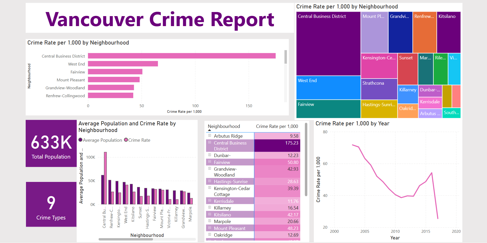
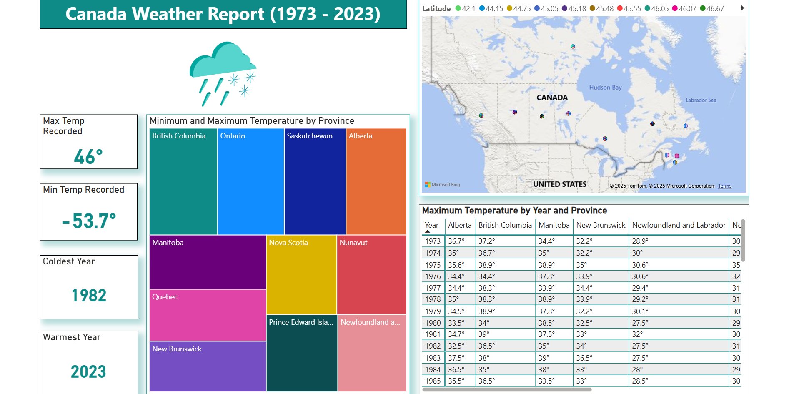

# Data Analyst

Welcome to my Data Analyst Portfolio! I specialize in uncovering insights through data visualization, machine learning, and storytelling. Below, you'll find a curated collection of my projects across **Power BI**, **Excel**, and **Machine Learning**, along with talks and publications.

---

## 📊 Power BI Dashboards

### [Vancouver Crime and Population Dashboard](https://app.powerbi.com/view?r=eyJrIjoiN2Q0MDlmZWEtN2E1ZS00Y2JiLTkwODctNTlhMjE2MmRiZGNkIiwidCI6IjE3MjhiMjgzLTlhYWItNDhiNi04YjAwLTI2OTQxYTI5MzkxMCJ9)
This dashboard analyzes Vancouver’s crime statistics in relation to population data. It reveals trends across districts and years to aid in resource allocation and public safety strategies.  

### [Canada Weather Report](https://app.powerbi.com/view?r=eyJrIjoiZjllOTEwNTMtM2U5My00YmVjLTgwYTktOWQ2YWNkNzQ4NTFmIiwidCI6IjE3MjhiMjgzLTlhYWItNDhiNi04YjAwLTI2OTQxYTI5MzkxMCJ9)

### [Sales Report Dashboard](https://app.powerbi.com/view?r=eyJrIjoiNzlmYTdhZWUtN2VjNS00ZjA1LWFiYmMtYjJiZTQzYzY5Mjc1IiwidCI6IjE3MjhiMjgzLTlhYWItNDhiNi04YjAwLTI2OTQxYTI5MzkxMCJ9)

### [Laptop Data Report](https://app.powerbi.com/view?r=eyJrIjoiNWRiZGFlYTEtM2FjOC00NjFiLWI3ZjQtMzAyMTllN2MyYzYxIiwidCI6IjE3MjhiMjgzLTlhYWItNDhiNi04YjAwLTI2OTQxYTI5MzkxMCJ9)

### [Mall Clustering Dashboard](https://app.powerbi.com/view?r=eyJrIjoiMDlhOGY0MGMtOTkzOC00ZGVhLWI0N2ItMmY3MDI5NzBiYjQ4IiwidCI6IjE3MjhiMjgzLTlhYWItNDhiNi04YjAwLTI2OTQxYTI5MzkxMCJ9)

### [Students Dashboard](https://app.powerbi.com/view?r=eyJrIjoiOTQ5NTU2ZjctODM2Zi00MzZhLTgxYjQtZGNjOTY4YWFlOTYyIiwidCI6IjE3MjhiMjgzLTlhYWItNDhiNi04YjAwLTI2OTQxYTI5MzkxMCJ9)

---

## Excel Projects

### [Vancouver Crime Analysis](https://1drv.ms/x/c/c34fb1dec43df6dc/Ef89l6rpG5dKvrZeLjSdq-kBp2kwuWUZlBSmbIn6Qud5Pg?e=SSxjpj)

### [Sales Data Cleaning & Analysis](https://1drv.ms/x/c/c34fb1dec43df6dc/EWDXnHNFH7tJs8qMc_XQeT0BzL8fs569EQ8n0AZYtGJQhw?e=w4B7eG)

### [Airline Customer Review Analysis](https://1drv.ms/x/c/c34fb1dec43df6dc/Ef3rVIPyzC9Ku2-CAkdVUEEB4s2q4PnYeuQ3E6E6lEH9Vg?e=Q0lGnM)

---

## Machine Learning Projects

### ✈️ Flight Price Prediction
Supervised regression model using airline data to predict flight ticket prices based on features like source, destination, duration, and number of stops.

### 🚘 GoAuto Project
A classification-based machine learning project to analyze and predict vehicle transmission types using customer and car specs data.

### 💻 Laptop Price Prediction
Regression modeling project estimating laptop prices using specifications like processor, RAM, and storage. Compared multiple ensemble models for best performance.

### 🏬 Mall Customer Clustering
Unsupervised learning with K-Means clustering to segment customers by annual income and spending score, visualized with Power BI.

---

## 🔧 Tools & Skills

- **Languages**: Python, SQL, DAX  
- **Tools**: Power BI, Excel, Google Sheets, Jupyter Notebook  
- **Libraries**: Pandas, NumPy, Scikit-learn, Seaborn, Matplotlib  
- **Certifications**: Microsoft Azure Fundamentals, IBM Data Analyst Professional  

---

### 📬 Let’s Connect!

Feel free to reach out on [LinkedIn](https://www.linkedin.com) or check out my [resume](./resume.pdf) for more details!

